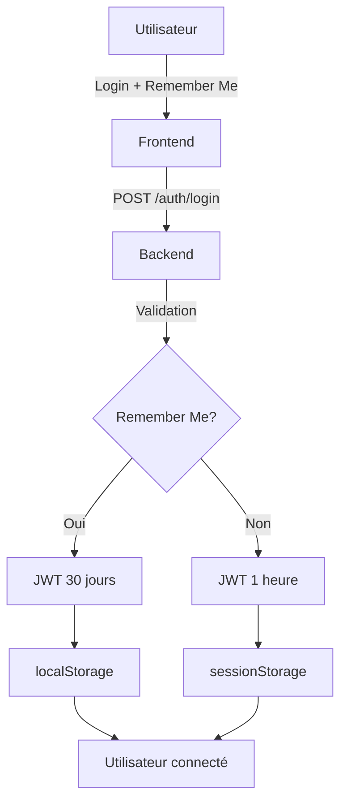

# Système d'Authentification - Track

## 🔐 Vue d'ensemble

Track utilise un système d'authentification JWT (JSON Web Tokens) avec support du "Remember Me" pour une expérience utilisateur optimale. Le système gère deux types de sessions :

- **Sessions courtes** (1 heure) - Par défaut
- **Sessions longues** (30 jours) - Avec "Remember Me"

## 🏗️ Architecture

### Backend (`/backend/src/routes/auth.js`)

Le système d'authentification fournit trois endpoints principaux :

#### **POST /api/auth/register**
Création de compte avec workspace automatique.

**Payload:**
```json
{
  "email": "user@example.com",
  "username": "johndoe",
  "full_name": "John Doe",
  "password": "securepassword"
}
```

**Réponse:**
```json
{
  "success": true,
  "data": {
    "user": {
      "id": 1,
      "email": "user@example.com",
      "username": "johndoe",
      "full_name": "John Doe",
      "default_workspace_id": 1
    },
    "token": "eyJhbGciOiJIUzI1NiIsInR5cCI6IkpXVCJ9..."
  }
}
```

#### **POST /api/auth/login**
Connexion avec support Remember Me.

**Payload:**
```json
{
  "email": "user@example.com",
  "password": "securepassword",
  "remember_me": false  // Optionnel, défaut: false
}
```

**Logique Remember Me:**
- `remember_me: false` → Token expire en 1h (session)
- `remember_me: true` → Token expire en 30 jours (persistant)

**Réponse:** Identique à register

#### **GET /api/auth/me**
Vérification du token et récupération des infos utilisateur.

**Headers requis:**
```
Authorization: Bearer <token>
```

### Frontend 

#### **AuthStore** (`/frontend/src/stores/authStore.js`)

Store Zustand gérant l'état d'authentification global :

**État:**
```javascript
{
  isAuthenticated: boolean,
  user: UserObject | null,
  token: string | null,
  rememberMe: boolean
}
```

**Méthodes principales:**

- `login(userData, token, rememberMe)` - Authentification
- `logout()` - Déconnexion
- `checkAuth()` - Vérification automatique au chargement
- `updateUser(userData)` - Mise à jour profil

#### **Stockage intelligent des tokens**

Le système utilise une approche hybride :

| Type de session | Stockage | Durée | Persistance |
|-----------------|----------|-------|-------------|
| **Normale** | `sessionStorage` | 1 heure | Fermeture navigateur |
| **Remember Me** | `localStorage` | 30 jours | Persistant |

**Avantages:**
- ✅ Sessions courtes = Sécurité maximale
- ✅ Remember Me = Confort utilisateur  
- ✅ Déconnexion auto à la fermeture (sessions courtes)
- ✅ Persistance multi-onglets (Remember Me)

## 🔧 Configuration

### Variables d'environnement

```bash
# Durée par défaut des tokens (sessions courtes)
JWT_EXPIRES_IN=1h

# Durée des tokens "Remember Me" (sessions longues)  
JWT_REMEMBER_EXPIRES_IN=30d

# Clé secrète JWT (CRITIQUE - changer en production)
JWT_SECRET=your_jwt_secret_here_change_in_production
```

### Structure des JWT tokens

```json
{
  "userId": 123,
  "remember_me": true,
  "iat": 1640995200,
  "exp": 1643587200
}
```

## 🎨 Interface utilisateur

### Page de connexion (`/frontend/src/pages/Login.jsx`)

**Fonctionnalités:**
- Basculement Login/Register
- Checkbox "Keep me signed in for 30 days"
- Gestion d'erreurs contextuelle
- Redirection automatique si déjà connecté

**Exemple d'interface:**
```
📧 Email: [________________]
🔐 Password: [_____________]
☑️ Keep me signed in for 30 days

[Sign In] | Don't have an account? Sign up
```

## 🛡️ Sécurité

### Mesures de sécurité implémentées

1. **Hachage des mots de passe** avec bcrypt (12 rounds)
2. **Tokens JWT signés** avec clé secrète forte
3. **Expiration automatique** des tokens
4. **Nettoyage automatique** des tokens invalides
5. **Validation côté serveur** de tous les endpoints protégés

### Bonnes pratiques

#### **En développement:**
```bash
JWT_SECRET=dev_secret_key_change_me
JWT_EXPIRES_IN=1h
JWT_REMEMBER_EXPIRES_IN=30d
```

#### **En production:**
```bash
JWT_SECRET=<générer une clé de 256+ caractères aléatoires>
JWT_EXPIRES_IN=15m  # Plus sécurisé
JWT_REMEMBER_EXPIRES_IN=7d  # Réduire à 7 jours max
```

### Protection contre les attaques

- **Token hijacking**: Expiration courte par défaut (1h)
- **Session fixation**: Nouveau token à chaque login
- **XSS**: Tokens en mémoire (pas de cookies HTTP-only car SPA)
- **CSRF**: Origin validation et tokens stateless

## 📊 Flux d'authentification



## 🔄 Gestion des sessions

### Scénarios de déconnexion automatique

1. **Session courte + fermeture navigateur** → Déconnecté ✅
2. **Session courte + expiration token** → Déconnecté ✅  
3. **Remember Me + 30 jours écoulés** → Déconnecté ✅
4. **Token invalide/corrompu** → Déconnecté + nettoyage ✅

### Reconnexion automatique

Le `checkAuth()` s'exécute au chargement de l'app :
- Vérifie `sessionStorage` en priorité
- Fallback sur `localStorage` 
- Valide le token auprès du serveur
- Restaure la session si valide

## 🧪 Tests et validation

### Tester le Remember Me

1. **Se connecter avec Remember Me coché**
2. **Fermer le navigateur complètement**
3. **Rouvrir → Toujours connecté** ✅

### Tester la session courte

1. **Se connecter SANS Remember Me** 
2. **Fermer l'onglet/navigateur**
3. **Rouvrir → Déconnecté** ✅

### Vérifier l'expiration

```javascript
// Dans la console du navigateur
const token = localStorage.getItem('auth_token') || sessionStorage.getItem('auth_token');
const payload = JSON.parse(atob(token.split('.')[1]));
console.log('Expire le:', new Date(payload.exp * 1000));
console.log('Remember Me:', payload.remember_me);
```

## 🚨 Dépannage

### Problèmes courants

**"Invalid token" après refresh**
- Vérifier que le token est présent dans le bon storage
- Contrôler l'expiration du JWT
- S'assurer que JWT_SECRET est identique backend/frontend

**Remember Me ne fonctionne pas**
- Vérifier `JWT_REMEMBER_EXPIRES_IN` dans l'environnement
- Contrôler que le payload contient `remember_me: true`
- Tester avec les DevTools → Application → Local Storage

**Déconnexion inattendue**
- Vérifier la durée des tokens (trop courte?)
- Contrôler les erreurs réseau dans la console
- S'assurer que l'horloge serveur est correcte

### Debugging

```javascript
// Activer les logs d'auth (dans authStore.js)
console.log('Token storage:', {
  session: sessionStorage.getItem('auth_token'),
  local: localStorage.getItem('auth_token')
});
```

## 📚 Ressources

- [JWT.io](https://jwt.io) - Décoder et tester les tokens
- [OWASP Auth Guide](https://owasp.org/www-project-authentication/) - Bonnes pratiques sécurité
- [Zustand Docs](https://github.com/pmndrs/zustand) - Store management
